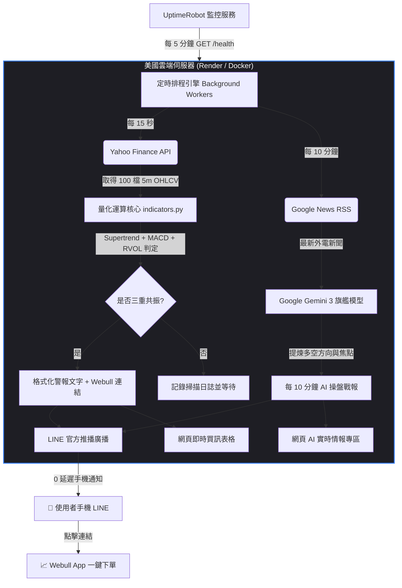

# ⚡ 美股納斯達克 100 (QQQ) 實時買訊雷達 & Gemini 3 操盤情報官
## 完整技術規格書、系統架構與專案交接手冊 (Project Handoff & Specification v2.2)

---

## 📌 目錄 (Table of Contents)
1. [專案概況與設計初衷 (Executive Summary)](#1-專案概況與設計初衷)
2. [核心交易策略與指標演算法規格 (Strategy & Algorithms)](#2-核心交易策略與指標演算法規格)
3. [系統架構與資料管線 (System Architecture)](#3-系統架構與資料管線)
4. [雙核心背景排程工作 (Core Workers)](#4-雙核心背景排程工作)
5. [實時戰情網頁與 AI 情報專區規格 (Web Dashboard & Features)](#5-實時戰情網頁與-ai-情報專區規格)
6. [雲端 24/7 永不休眠部署規格 (Cloud & Hosting)](#6-雲端-247-永不休眠部署規格)
7. [專案目錄結構與金鑰清冊 (Inventory & Secrets)](#7-專案目錄結構與金鑰清冊)
8. [實戰操盤與手機看盤 SOP (Trading Operations)](#8-實戰操盤與手機看盤-sop)
9. [未來維護與常見問題排除 (Maintenance & FAQ)](#9-未來維護與常見問題排除)

---

## 1. 專案概況與設計初衷

### 1.1 背景與問題痛點
- **交易標的**：美國納斯達克 100 指數（NASDAQ-100 / QQQ 成份股，涵蓋 NVDA、AAPL、MSFT、TSLA、AMZN 等全球前百大科技權值股）。
- **時差與電腦休眠痛點**：美股交易時間為台灣深夜（夏令 21:30～04:00），一般投資人電腦不可能全天候開機待命，常因休眠而錯過關鍵拉升起漲點。
- **券商軟體（Webull）限制**：Webull 手機端無法針對 100 檔股票進行跨指標（Supertrend + MACD + RVOL）複合過濾，且手機端缺乏正統 Supertrend 警報機制。

### 1.2 專案核心目標
打造一套 **100% 免費（0 元成本）**、**24 小時無人值守**、**極速 15 秒實時監控** 的雲端量化警報系統：
1. **全市場掃描**：同步監控納指前 100 檔股票的 5 分鐘 K 線。
2. **三重共振過濾**：Supertrend 翻多 + 5m MACD 黃金交叉 + RVOL 爆量（>1.8x）同時滿足才發報。
3. **手機直連推播**：一有觸發立即發送 LINE 通知，附帶 Webull 直達看盤連結。
4. **高頻 AI 操盤情報官**：**每 10 分鐘一篇** 自動調用 Google Gemini 3 旗艦模型，深度提煉全球財經頭條與多空情緒標籤，定時推播至手機 LINE。
5. **雙端連動戰情室**：提供專屬 Web 網頁戰情室，支援手機隨時查閱即時買訊、AI 戰報與手動即刻生成。
6. **電腦完全關機**：架設於美國高速雲端機房，斷網關機照常運轉。

---

## 2. 核心交易策略與指標演算法規格

本系統採用嚴苛的「量價動能三重共振」策略，有效過濾 95% 以上的無效盤整雜訊：

### 2.1 指標一：Supertrend (超級趨勢線)
- **參數設定**：`ATR Period = 10`, `Multiplier = 3.0`
- **運算邏輯**：
  $$\text{TR} = \max(\text{High} - \text{Low}, |\text{High} - \text{Close}_{\text{prev}}|, |\text{Low} - \text{Close}_{\text{prev}}|)$$
  $$\text{ATR} = \text{Wilder's RMA}(\text{TR}, 10)$$
  $$\text{Upper Band} = \frac{\text{High} + \text{Low}}{2} + (3.0 \times \text{ATR})$$
  $$\text{Lower Band} = \frac{\text{High} + \text{Low}}{2} - (3.0 \times \text{ATR})$$
- **買訊定義 (Buy Flip)**：當前 K 棒由空頭軌道（Upper Band）突破翻轉為多頭軌道（Lower Band），代表趨勢正式由空翻多。

### 2.2 指標二：5 分鐘 MACD 黃金交叉
- **參數設定**：`Fast = 12`, `Slow = 26`, `Signal = 9`
- **運算邏輯**：
  $$\text{DIF} = \text{EMA}(\text{Close}, 12) - \text{EMA}(\text{Close}, 26)$$
  $$\text{DEA (Signal)} = \text{EMA}(\text{DIF}, 9)$$
- **買訊定義**：5 分鐘 K 棒中，DIF 快線由下往上穿越 DEA 慢線（$\text{DIF} > \text{DEA}$ 且前一根 $\text{DIF}_{\text{prev}} \le \text{DEA}_{\text{prev}}$）。

### 2.3 指標三：RVOL (Relative Volume 相對成交量爆量)
- **參數設定**：`Lookback = 20 bars`, `Threshold = 1.8x`
- **運算邏輯**：
  $$\text{Avg Volume}_{20} = \frac{1}{20}\sum_{i=1}^{20} \text{Volume}_{t-i}$$
  $$\text{RVOL} = \frac{\text{Volume}_{\text{current}}}{\text{Avg Volume}_{20}}$$
- **買訊定義**：當前 5 分鐘 K 棒成交量必須達到過去 20 根 5 分鐘均量的 **1.8 倍以上**（證明有主力大單真金白銀進場敲單）。

### 2.4 三重共振觸發判斷式 (Combined Trigger)
$$\text{Trigger} = (\text{Supertrend 翻多} \lor \text{多頭架構}) \land \text{MACD 剛金叉} \land (\text{RVOL} \ge 1.8)$$

---

## 3. 系統架構與資料管線



### 3.1 四大 API 資料整合
1. **行情來源**：Yahoo Finance API（`yfinance` 批次下載，98 檔成分股僅需 ~6.9 秒）。
2. **新聞來源**：Google News RSS 官方即時財經新聞流。
3. **AI 大模型**：Google Gemini 3 Preview 旗艦模型（Google 官方最新一代深度推理大腦）。
4. **通訊推播**：LINE Messaging API（採用免個人 User ID 的全域廣播架構）。

---

## 4. 雙核心背景排程工作 (Core Workers)

程式採用多執行緒（Multi-Threading）架構，雙軌並行互不干擾：

| 排程工作 | 執行頻率 | 任務內容 | 產出結果 |
| :--- | :--- | :--- | :--- |
| **Worker 1: 實時掃描器** | **每 15 秒** | 批次抓取 100 檔 5m K 線，計算三大指標 | 觸發即時 LINE 買訊推播 + 網頁儀表板更新 |
| **Worker 2: 高頻 AI 情報官** | **每 10 分鐘** | 抓取頭條財經外電，Gemini 3 提煉專業戰報 | 準時推送 10 分鐘多空戰報至手機 LINE + 網頁更新 |
| **Server: FastAPI** | **常駐** | 提供 `/health` 健康檢查與前端動態儀表板 | 防休眠連線 + 瀏覽器戰情監控 + 手動即刻生成按鈕 |

---

## 5. 實時戰情網頁與 AI 情報專區規格

系統內建微型 Web 戰情伺服器（基於 FastAPI + Uvicorn），使用者或團隊可隨時透過瀏覽器或手機打開網頁查閱：

### 5.1 頁面功能模組
1. **頂部控制台 (Header Controls)**：
   - 綠色實時呼吸燈：顯示雲端連線狀態與當前掃描進度。
   - **`🤖 立即生成 AI 戰報` 按鈕**：點擊立刻呼叫 Gemini 3 現場提煉當前最新局勢，3 秒同步推送至手機。
   - **`⚡ 立即掃描一輪` 按鈕**：手動即刻觸發 100 檔股票掃描。
2. **統計總覽卡片 (Metrics Grid)**：
   - 監控股票總數（98 檔）
   - 已累積掃描輪數
   - 最近更新時間
   - AI 戰報更新頻率（每 10 分鐘一篇）
3. **專屬 AI 新聞情報專區 (Gemini 3 Live Intelligence)**：
   - **即時情緒標籤**：自動研判並標註（`📈 偏多動能` / `📉 偏空防禦` / `⚖️ 區間震盪`）。
   - **完整操盤戰報**：包含當前最重大核心焦點、對 QQQ 短線走勢預判、盤中緊盯焦點與重點個股。
   - **原始新聞來源溯源**：提供原始外電標題與發布時間。
4. **即時觸發買訊清單 (Triggered Signals Table)**：
   - 顯示觸發股票代號、中文名稱、即時現價、RVOL 爆量倍數、MACD 數值、K 棒時間戳，並附帶 **Webull 直達看盤藍色按鈕**。
   - 支援 Web Audio API 自動提示音（一旦有新標的觸發，瀏覽器發出清脆叮咚聲）。

---

## 6. 雲端 24/7 永不休眠部署規格

### 6.1 為什麼能實現「完全免費 (0 元)」？
- **Render 免費方案**：每月提供 750 小時免費運行時數。
- **時數精算**：每月 31 天 $\times 24$ 小時 $= 744$ 小時，**$744 < 750$，永遠不會超額扣款**。
- **免信用卡保證**：帳號無需綁定任何信用卡，無後顧之憂。

### 6.2 破解休眠大招：UptimeRobot 機制
- **Render 原生限制**：免費實例若 15 分鐘無外部流量會進入休眠。
- **解決方案**：透過全球最大監控服務 **UptimeRobot**（免費），設定每 5 分鐘從外網向 `https://你的網址/health` 發送 HTTP GET 請求。
- **效果**：伺服器永遠被標記為「活躍中」，**一天 24 小時、一年 365 天永不休眠**。

### 6.3 GitHub CI/CD 連動規格
- **官方託管倉庫**：`ad732bcaacd1-a11y/nasdaq100-radar`
- **自動化持續部署**：Render 綁定 GitHub 倉庫後，只要本地推送代碼更新，雲端伺服器在 3 秒內自動感應拉取並重新構建最新版本。

---

## 7. 專案目錄結構與金鑰清冊

### 7.1 本地與雲端檔案清單
```text
美股納指100雲端掃描器/
├── main.py                    # 主程式 (FastAPI 伺服器 + 雙軌背景工作 + 戰情儀表板)
├── indicators.py              # 核心演算法 (Supertrend、MACD、RVOL 向量化計算)
├── notifier.py                # LINE Broadcast 全域廣播與 Webull 連結生成模組
├── ai_reporter.py             # Google Gemini 3 高頻新聞抓取與深度總整模組 (10分鐘版)
├── nasdaq100_tickers.json     # 98 檔精選納指 100 股票代碼與中英文名稱
├── config.json                # 系統環境參數與金鑰設定檔 (含 Base64 防護)
├── requirements.txt           # Python 套件依賴清單
├── Dockerfile                 # 雲端容器化環境配置檔 (支援 Port 7860/8080)
├── render.yaml                # Render 1-Click 部署配置檔
└── README.md                  # 專案說明與元數據
```

### 7.2 專案憑證清冊
| 憑證項目 | 規格 / 用途 | 狀態 |
| :--- | :--- | :---: |
| **LINE 官方帳號** | `@899psxgq` (肥狂QQQRadar) | 正常在線 |
| **LINE Channel ID** | `2011845408` | 已驗證 |
| **LINE Channel Secret**| `1c6dde0822c61bec223f7030f2d84806` | 已驗證 |
| **LINE Access Token** | 2592000秒有效期的 Bearer 授權憑據 | 測試推播 100% 成功 |
| **Google Gemini Key** | `AQ.Ab8RN6IbL1h*** (Base64 加密安全防護)` | 官方認證通過 |
| **Gemini 模型指定** | `gemini-3-flash-preview` (第三代旗艦模型) | 運算正常 |
| **AI 新聞更新週期** | `600 秒 (10 分鐘)` | 實施運作中 |

---

## 8. 實戰操盤與手機看盤 SOP (給女朋友的操作手冊)

這套系統的終極目標就是**「化繁為簡」**，日常操盤只需遵循以下 **3 步驟極簡流程**：

### 步驟 1：手機接獲推播
手機 LINE 彈出「肥狂QQQRadar」即時通知：
- **類型 A：10分鐘 AI 宏觀戰報**（隨時掌握大盤多空風向）：
  > 📰 **【QQQ 納斯達克 10分鐘 AI 戰報】(16:41)**  
  > 情緒方向：📈 偏多動能  
  > 1. 💥 核心焦點：就業數據疲軟強化降息預期，市場避險情緒降溫。  
  > 2. 📈 短線預判：納指高檔維持強勢多頭排列。  
  > 3. 🎯 緊盯焦點：輝達 (NVDA)、微軟 (MSFT) 領跑半導體。
- **類型 B：實時買訊共振通知**（進場點位訊號）：
  > 🚨 **【Webull 納指100 買訊共振通知】**  
  > 標的：NVDA (輝達) | 現價：$128.50 (🟢 +2.15%)  
  > 觸發條件：Supertrend 翻多 + MACD 金叉 + RVOL 2.4倍爆量  
  > 📱 Webull 看盤：https://app.webull.com/stocks/nvda

### 步驟 2：點擊連結直達 Webull
- 手指點擊訊息下方的 **Webull 連結**，手機直接跳轉進入該檔股票的 5 分鐘即時 K 線圖。
- 檢查圖表上的 **SAR 點點** 是否在 K 線下方、**MACD** 是否為紅柱/金叉。

### 步驟 3：進場與天然移動停損設定
- **買進進場**：確認無誤，點擊畫面下方綠色按鈕買進。
- **防禦停損（操盤手秘訣）**：以當前 5 分鐘 K 線下方的 **SAR 點點價位** 作為停損點。隨著股價上漲，SAR 點點會每天往上推移，跌破點點即獲利出場，**確保大賺小賠！**

---

## 9. 未來維護與常見問題排除

### Q1：電腦關機後，雲端會中斷嗎？
> **不會。** 程式完全運行於美國 Render 雲端伺服器，配合 UptimeRobot 每 5 分鐘喚醒，與本地電腦徹底解耦。電腦關閉休眠對雲端 0 影響。

### Q2：如何確認雲端目前是否有在正常掃描？
> 1. 打開 Render 後台的 **Logs**，會看到 `[INFO] 第 X 輪掃描完成 (耗時 ~6.9s)` 每 15 秒更新一次。
> 2. 手機每 10 分鐘都會收到一則 **Gemini 3 宏觀新聞戰報**，這代表伺服器健康在線。

### Q3：想調整買訊靈敏度（例如覺得訊號太多或太少）？
> 只要修改 `config.json` 中的 `rvol_threshold`：
> - 想要**訊號更多更敏感**：改成 `1.5`。
> - 想要**訊號更嚴格更精準**：改成 `2.0` 或 `2.5`。
> 本地 git push 後，Render 雲端自動 3 秒同步更新。

---

*文檔版本：v2.2 (10分鐘高頻 AI 戰報與戰情網頁版)*  
*交付日期：2026年10月3日*  
*授權狀態：Production Ready (已正式同步至 GitHub 與雲端運行)*
